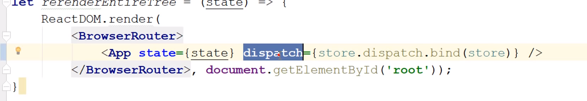

## Usually we have 

## But we can use one function to manage all functions by passing actio in it 

## But what if you want dispatch run function with params , so you should pass this params to dispatcher

## After making dispatch you can pass it as props to main rendfering method in order to pass it through whole app

